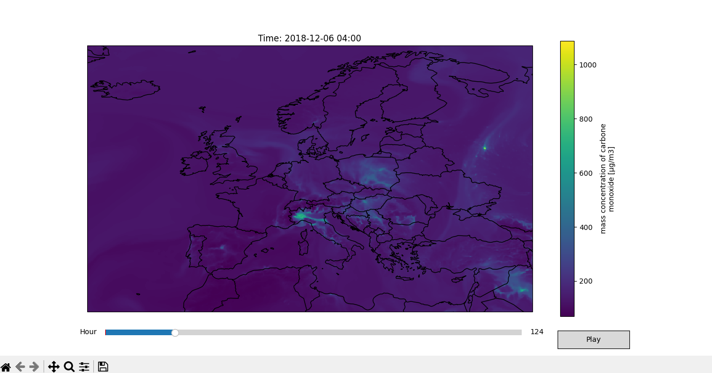

# Europe-air-pollution
Download CAMS European air quality reanalyses data from Copernicus A.D.S. and visualize it on a geographic map projection.

## DATA SOURCE:
-[CAMS Europe Air Quality Reanalyses Dataset](https://ads.atmosphere.copernicus.eu/datasets/cams-europe-air-quality-reanalyses?tab=download)

## HOW TO RUN:
1. Install required python libraries.
2. Create a ECMWF account for an api key.
3. Create a .cdsapirc file in your home directory with you API key (https://ads.atmosphere.copernicus.eu/how-to-api).
4. In Download-data.py select settings by uncommenting (some settings dont work together).
5. Extract .nc files from temp.zip into project directory.
6. In Visualize-data.py select a pollutant,elevation,year and month to visualize.

Example: Carbon Monoxide concentration over europe December 2018

