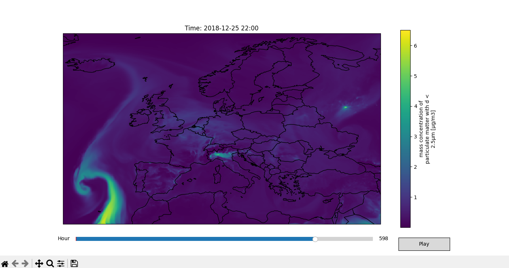

# Europe-air-pollution
Download CAMS European air quality reanalyses data from Copernicus A.D.S. and visualize it on a geographic map projection.

## DATA SOURCE:
[CAMS Europe Air Quality Reanalyses Dataset](https://ads.atmosphere.copernicus.eu/datasets/cams-europe-air-quality-reanalyses?tab=download)

## HOW TO RUN:
1. Install required python libraries.
2. Create a ECMWF account for an api key.
3. Create a .cdsapirc file in your home directory with your [API key](https://ads.atmosphere.copernicus.eu/how-to-api).
4. In Download-data.py select settings by uncommenting (some settings dont work together).
5. Extract .nc files from temp.zip into project directory.
6. In Visualize-data.py select a pollutant,elevation,year and month to visualize.
7. (If you change the model/type) check the file you downloaded and set the settings accordingly cams.eaq.{type}.{model}.{pollutant}.l{elev}.{year}-{month}.nc

Example:
Carbon Monoxide concentration over Europe December 2018

Particulate matter with d<2.5µm concentration over Europe December 2018

